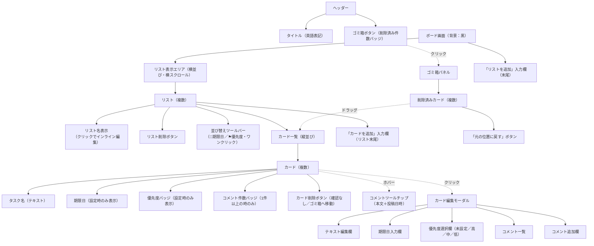
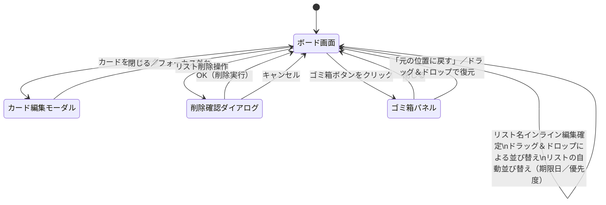
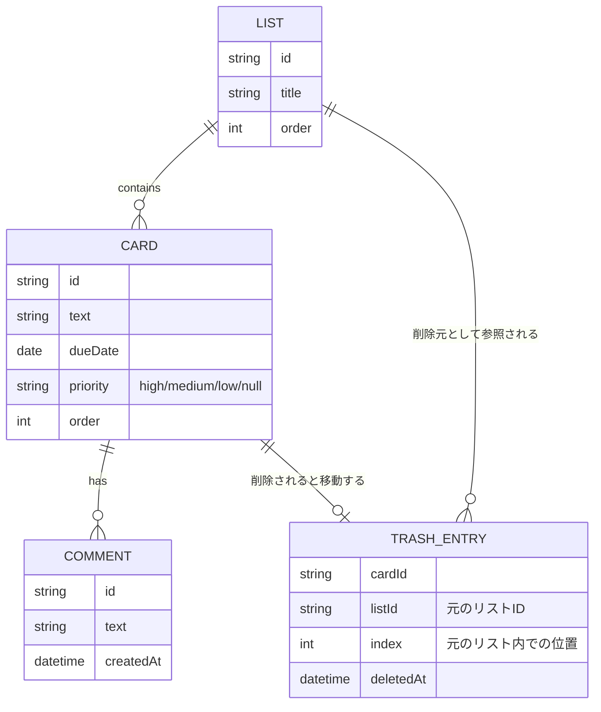

# トレロ風タスク管理アプリ 要件定義書

## 目次（概要）

各項目の概要と、詳細セクションへのリンクをまとめる。

| 項目 | 概要 | 詳細 |
|---|---|---|
| 技術構成 | フロントエンドはReact+TypeScript（Vite）、バックエンドはJava/Spring Boot+PostgreSQL。旧プロトタイプ（HTML/CSS/JS+localStorage）は`legacy/`に保存 | [詳細へ](#2-技術構成) |
| 画面構成 | ボード画面を中心に、カード編集モーダル・削除確認ダイアログ・ゴミ箱パネル・コメントツールチップで構成される単一画面（SPA） | [詳細へ](#3-画面構成) |
| 機能要件 | リスト・カードのCRUD、ドラッグ＆ドロップ並び替え、優先度・期限日・コメント、ソフトデリート＋7日間ゴミ箱、バリデーション仕様 | [詳細へ](#4-機能要件) |
| データ構造 | リスト・カード・コメント・ゴミ箱エントリのER図と保存データ形式 | [詳細へ](#5-データ構造) |
| 非機能要件 | 対応環境、レスポンシブ非対応、認証・複数ユーザー非対応、想定データ量、セキュリティ方針 | [詳細へ](#6-非機能要件) |
| リスクと対応方針 | データ消失・容量上限・同時編集・誤削除などのリスクと、それぞれの対応方針 | [詳細へ](#7-リスクと対応方針) |
| 今後の拡張候補 | サーバー・DB対応（本実装で対応）、ラベル・担当者、検索・フィルタなど | [詳細へ](#8-今後の拡張候補今回の対象外) |

## 1. 概要
ブラウザ上で動作する、Trelloに似たカンバン形式のタスク管理アプリを作成する。
当初はサーバー・ビルド環境を用意せずHTML/CSS/JavaScriptのみで動作するプロトタイプとして作成したが（`legacy/`フォルダに保存）、本実装ではフロントエンドをReact、バックエンドをJava/Spring Boot + PostgreSQLとするフルスタック構成に移行する。機能要件（3〜4章）はプロトタイプと同等とし、データ保存先を`localStorage`から実データベースに変更する。

## 2. 技術構成

### 2.1 本実装（フルスタック構成）
- フロントエンド: React + TypeScript（Vite、Next.js不使用）
- バックエンド: Java + Spring Boot（Maven）
- データベース: PostgreSQL（スキーマ管理はFlyway）
- ローカル開発: PostgreSQLはDocker Composeで起動。フロントエンドはVite開発サーバー（プロキシ経由でバックエンドAPIへアクセス）
- データ保存は実データベース（PostgreSQL）で行い、ブラウザ・端末を問わず永続化する

### 2.2 プロトタイプ版（参考・`legacy/`フォルダに保存）
- プレーンHTML / CSS / JavaScript（フレームワーク・ビルドツール不使用）
- データ保存は `localStorage` を使用し、ブラウザを閉じても・再起動してもデータを保持する

## 3. 画面構成

### 3.1 画面一覧
本アプリは単一画面（SPA）で構成し、ページ遷移は行わない。カードの編集や削除確認は、ボード画面の上にモーダル／ダイアログを重ねて表示する。

| 画面・UI要素 | 概要 |
|---|---|
| ボード画面 | メイン画面。複数のリストを横並びに表示し、リスト・カードの全操作を行う唯一の画面 |
| カード編集モーダル | カードをクリックした際に表示。テキスト・期限日・優先度・コメントを編集する |
| 削除確認ダイアログ | リスト削除の操作時に表示する確認ダイアログ（カード削除は確認なしでゴミ箱に移動する） |
| ゴミ箱パネル | 画面右上のボタンから開く、削除済みカードの一覧パネル |
| コメントツールチップ | カードにマウスを乗せた際に表示する、コメント内容のポップアップ表示 |

### 3.2 ボード画面のレイアウト構成



### 3.3 画面遷移・状態遷移図



## 4. 機能要件

### 4.1 リスト
- アプリ初回起動時（`localStorage`にデータが存在しない場合）、初期状態として「作業中」「完了」の2リストを自動作成する
- リストの新規追加ができる（リスト名を入力して作成）
  - 入力欄にリスト名を入力し、追加操作（ボタン押下またはEnter）でリストの末尾に追加する
  - リスト名が空欄の場合は追加しない
- リストの削除ができる
  - 削除操作時に確認ダイアログを表示し、OKの場合のみ削除する
  - リストを削除した場合、そのリストに含まれるカードもすべて削除する
- リスト名のリネームができる
  - リスト名をクリックすると編集状態になり、フォーカスが外れる、またはEnterで確定する
  - 編集後の名前が空欄の場合は変更前の名前を保持する
- ドラッグ＆ドロップによりリストの並び順を変更できる
  - ドロップした位置に応じて並び順を更新し、即時保存する
  - ドラッグ中はドロップ予定位置に縦線のインジケーターを表示する
- リスト単位でカードの自動並び替えができる（手動のドラッグ＆ドロップ並び替えと併用可能）
  - 「📅期限日」ボタン：ワンクリックで期限日が近い順にカードを並べ替える（期限日未設定のカードは末尾に配置）
  - 「⚑優先度」ボタン：ワンクリックで優先度が高い順（高→中→低→未設定）にカードを並べ替える
  - 並び替え結果は即時保存し、その後も手動でのドラッグ＆ドロップ並び替えが可能

### 4.2 カード
カードは以下の情報を持つ。
- テキスト（タスク名・必須）
- 期限日（任意）
- 優先度（任意・「高」「中」「低」のいずれか、未設定可）
- コメント（任意・複数件登録可能）

カードに対して以下の操作ができる。
- カードの新規追加（リスト単位）
  - リスト内の入力欄にテキストを入力し、追加操作で当該リストの末尾に追加する
  - テキストが空欄の場合は追加しない
  - 追加時点では期限日・優先度は未設定とする（編集モーダルから設定する）
- カードの削除
  - 確認ダイアログは表示せず、操作した時点で即座にボードから削除する
  - 削除したカードは完全には消去せず、後述の「ゴミ箱」に移動する
- カードの編集（テキスト・期限日・優先度・コメントの変更）
  - カードをクリックすると編集用の画面（モーダルまたはインライン編集）を開く
  - コメントは追加のみ可能とし、既存コメントの編集・削除は対象外とする
- カードにマウスカーソルを乗せると、そのカードのコメント一覧をツールチップ表示する
  - コメントが1件以上登録されている場合のみ表示する（カーソルが外れたら非表示にする）
- ドラッグ＆ドロップによるリスト間の移動、および同一リスト内での並び替え
  - ドロップした位置に応じて挿入位置を決定し、即時保存する
  - ドラッグ中はドロップ予定位置に横線のインジケーターを表示し、移動先を視覚的に分かるようにする

#### 4.2.1 ゴミ箱（削除済みカード）
- 画面右上の「ゴミ箱」ボタンから、削除済みカードの一覧パネルを開閉できる。ボタンには削除済み件数を表示する
- ゴミ箱に入ったカードは、削除された時点から1週間が経過すると自動的に完全削除される
- ゴミ箱の各カードはドラッグ＆ドロップでボード上の任意のリストへ戻すことができる（ドロップした位置に挿入される）
- ゴミ箱の各カードには「元の位置に戻す」ボタンを設け、削除前と同じリスト・同じ位置に復元できる
  - 元のリストが既に削除されている場合は、復元できない旨を通知し、ゴミ箱に残す（ドラッグでの復元は引き続き可能）

### 4.3 バリデーション仕様
- リスト名: 必須、1文字以上50文字以内
- カードテキスト: 必須、1文字以上200文字以内
- 期限日: 任意。入力する場合は `YYYY-MM-DD` 形式とする（過去日付も許容する）
- 優先度: 任意。「未設定」「高」「中」「低」の4択から選択する（自由入力ではなく選択式のため形式不正は発生しない）
- コメント: 任意。入力する場合は1文字以上とし、空欄での追加はできない
- 必須項目が未入力・形式不正の場合は保存・追加処理を行わず、入力を促す表示を行う

### 4.4 データ保存
- リスト・カードの全データは `localStorage` に保存する
- ゴミ箱（削除済みカードと、元のリストID・元の位置・削除日時）も同じ`localStorage`内に保存する
- ページ再読み込み・ブラウザ再起動後も、保存したデータがそのまま復元される

## 5. データ構造

### 5.1 データモデル（ER図）



### 5.2 保存データの形式（localStorage格納イメージ）

```json
{
  "lists": [
    {
      "id": "list-1",
      "title": "作業中",
      "cards": [
        {
          "id": "card-1",
          "text": "サンプルタスク",
          "dueDate": "2026-07-01",
          "priority": "high",
          "comments": [
            { "id": "comment-1", "text": "メモ", "createdAt": "2026-06-27T00:00:00" }
          ]
        }
      ]
    },
    { "id": "list-2", "title": "完了", "cards": [] }
  ],
  "trash": [
    {
      "cardId": "card-9",
      "listId": "list-1",
      "index": 2,
      "card": { "id": "card-9", "text": "削除されたタスク", "dueDate": null, "priority": null, "comments": [] },
      "deletedAt": 1782500000000
    }
  ]
}
```

- リストの並び順は配列 `lists` の順序そのもので管理する（並び替え時はこの配列を入れ替えて保存）。
- `trash` 配列は削除済みカードのスナップショットを保持する。`deletedAt` はUNIXタイムスタンプ（ミリ秒）で、ここから1週間経過したエントリは自動的に配列から取り除かれる。
- アプリ初回起動時（`localStorage`にキー自体が存在しない場合）のみ、上記のように「作業中」「完了」の2リストを初期データとして生成する。

## 6. 非機能要件
- 対応環境: 最新版のGoogle Chrome、Microsoft Edge（直近2バージョン程度を想定）
- レスポンシブ対応: 対象外（PC画面前提、必要なら後日拡張）
- 認証・複数ユーザー対応: 対象外
- データ量想定: リストは10件程度、カードは全リスト合計100件程度までを想定する
- セキュリティ: 個人情報・機密情報の入力は想定しない。データはブラウザの`localStorage`内にのみ保存し、外部への送信は行わない

## 7. リスクと対応方針
- ブラウザのキャッシュ削除・別ブラウザでの利用時にデータが消失する
  - 対応方針: 今回は許容するリスクとし、バックアップ機能は対象外とする
- `localStorage`の容量上限（ブラウザ依存、目安5MB程度）を超えるとデータ保存に失敗する
  - 対応方針: 上記「データ量想定」の範囲内であれば問題ないものとし、上限超過時の対応は対象外とする
- 複数タブで同時に開いて編集した場合、後から保存した内容で上書きされる
  - 対応方針: 個人が単独で使用する前提のため対応不要とする
- カードを誤って削除しても確認ダイアログがないため、即座にゴミ箱へ移動する
  - 対応方針: ゴミ箱から1週間以内であれば「元の位置に戻す」またはドラッグ＆ドロップで復元可能とし、誤削除のリスクを許容する
- ゴミ箱に保持しているカードの元のリストが削除された場合、「元の位置に戻す」が使えない
  - 対応方針: その場合は通知を表示し、ドラッグ＆ドロップで別のリストへ復元する手段を提供する

## 8. 今後の拡張候補（今回の対象外）
- サーバー・データベースへの保存（複数端末での共有）
- ラベル・担当者などの追加属性
- 検索・フィルタ機能
