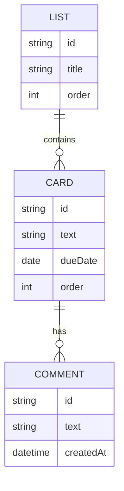

# トレロ風タスク管理アプリ 要件定義書

## 1. 概要
ブラウザ上で動作する、Trelloに似たカンバン形式のタスク管理アプリを作成する。
学習目的のため、サーバーやビルド環境を用意せず、HTML/CSS/JavaScriptのみで動作させる。

## 2. 技術構成
- プレーンHTML / CSS / JavaScript（フレームワーク・ビルドツール不使用）
- データ保存は `localStorage` を使用し、ブラウザを閉じても・再起動してもデータを保持する

## 3. 画面構成
- ボード画面（メイン画面）
  - 複数の「リスト」を横並びで表示
  - 画面上部または末尾に「リストを追加」する入力欄

## 4. 機能要件

### 4.1 リスト
- リストの新規追加ができる（リスト名を入力して作成）
  - 入力欄にリスト名を入力し、追加操作（ボタン押下またはEnter）でリストの末尾に追加する
  - リスト名が空欄の場合は追加しない
- リストの削除ができる
  - 削除操作時に確認ダイアログを表示し、OKの場合のみ削除する
  - リストを削除した場合、そのリストに含まれるカードもすべて削除する
- リスト名のリネームができる
  - リスト名をクリックすると編集状態になり、フォーカスが外れる、またはEnterで確定する
  - 編集後の名前が空欄の場合は変更前の名前を保持する
- ドラッグ＆ドロップによりリストの並び順を変更できる
  - ドロップした位置に応じて並び順を更新し、即時保存する

### 4.2 カード
カードは以下の情報を持つ。
- テキスト（タスク名・必須）
- 期限日（任意）
- コメント（任意・複数件登録可能）

カードに対して以下の操作ができる。
- カードの新規追加（リスト単位）
  - リスト内の入力欄にテキストを入力し、追加操作で当該リストの末尾に追加する
  - テキストが空欄の場合は追加しない
- カードの削除
  - 削除操作時に確認ダイアログを表示し、OKの場合のみ削除する
- カードの編集（テキスト・期限日・コメントの変更）
  - カードをクリックすると編集用の画面（モーダルまたはインライン編集）を開く
  - コメントは追加のみ可能とし、既存コメントの編集・削除は対象外とする
- ドラッグ＆ドロップによるリスト間の移動、および同一リスト内での並び替え
  - ドロップした位置に応じて挿入位置を決定し、即時保存する

### 4.3 バリデーション仕様
- リスト名: 必須、1文字以上50文字以内
- カードテキスト: 必須、1文字以上200文字以内
- 期限日: 任意。入力する場合は `YYYY-MM-DD` 形式とする（過去日付も許容する）
- コメント: 任意。入力する場合は1文字以上とし、空欄での追加はできない
- 必須項目が未入力・形式不正の場合は保存・追加処理を行わず、入力を促す表示を行う

### 4.4 データ保存
- リスト・カードの全データは `localStorage` に保存する
- ページ再読み込み・ブラウザ再起動後も、保存したデータがそのまま復元される

## 5. データ構造

### 5.1 データモデル（ER図）



### 5.2 保存データの形式（localStorage格納イメージ）

```json
{
  "lists": [
    {
      "id": "list-1",
      "title": "To Do",
      "cards": [
        {
          "id": "card-1",
          "text": "サンプルタスク",
          "dueDate": "2026-07-01",
          "comments": [
            { "id": "comment-1", "text": "メモ", "createdAt": "2026-06-27T00:00:00" }
          ]
        }
      ]
    }
  ]
}
```

リストの並び順は配列 `lists` の順序そのもので管理する（並び替え時はこの配列を入れ替えて保存）。

## 6. 非機能要件
- 対応環境: 最新版のGoogle Chrome、Microsoft Edge（直近2バージョン程度を想定）
- レスポンシブ対応: 対象外（PC画面前提、必要なら後日拡張）
- 認証・複数ユーザー対応: 対象外
- データ量想定: リストは10件程度、カードは全リスト合計100件程度までを想定する
- セキュリティ: 個人情報・機密情報の入力は想定しない。データはブラウザの`localStorage`内にのみ保存し、外部への送信は行わない

## 7. リスクと対応方針
- ブラウザのキャッシュ削除・別ブラウザでの利用時にデータが消失する
  - 対応方針: 今回は許容するリスクとし、バックアップ機能は対象外とする
- `localStorage`の容量上限（ブラウザ依存、目安5MB程度）を超えるとデータ保存に失敗する
  - 対応方針: 上記「データ量想定」の範囲内であれば問題ないものとし、上限超過時の対応は対象外とする
- 複数タブで同時に開いて編集した場合、後から保存した内容で上書きされる
  - 対応方針: 個人が単独で使用する前提のため対応不要とする

## 8. 今後の拡張候補（今回の対象外）
- サーバー・データベースへの保存（複数端末での共有）
- ラベル・担当者などの追加属性
- 検索・フィルタ機能
